# Documento de entrega I

## Punto 1a
Para la configuración de Amazon RDS dentro del servicio AWS Elastic Beanstalk, durante el proceso de creación del entorno se habilitó la opción correspondiente a RDS, tal como se muestra en la siguiente imagen:

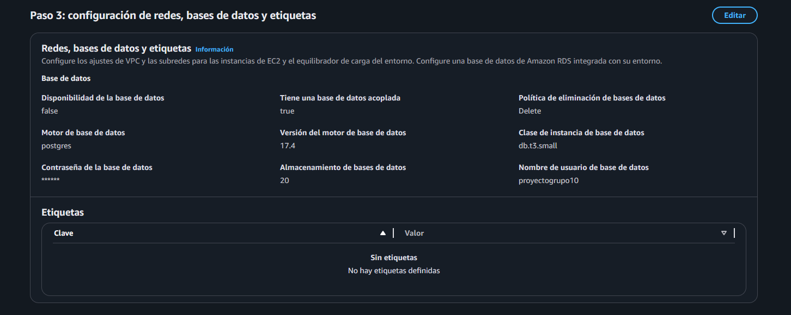

En dicha configuración, se especificó una base de datos con motor PostgreSQL (17.4) y cuando el servicio de AWS Elastic Beanstalk eliminé la aplicación, la base de datos también será eliminada ya que estamos en un entorno de desarrollo y no requerimos guardar instancias de AWS RDS.

Para permitir que la aplicación utilice esta base de datos, dentro del archivo principal de la aplicación `application.py` se definió la conexión mediante variables de entorno, las cuales son generadas automáticamente por Beanstalk al momento de crear el entorno con la instancia de RDS asociada.

En el siguiente fragmento de código se muestra la configuración utilizada para establecer la conexión con la base de datos:

```python
#Creamos la aplicacion de Flask
application = Flask(__name__)

#Ponemos configuraciones de la app
application.config['SQLALCHEMY_DATABASE_URI'] = (
    f"postgresql://{os.getenv('RDS_USERNAME')}:{os.getenv('RDS_PASSWORD')}"
    f"@{os.getenv('RDS_HOSTNAME')}:{os.getenv('RDS_PORT')}/{os.getenv('RDS_DB_NAME')}"
)
```

## Punto 1b

Para la configuración de la aplicación en AWS Elastic Beanstalk, el primer paso consistió en crear y configurar el entorno de ejecución. Este se inicializó como un entorno de tipo “Aplicación de ejemplo”, lo que permite posteriormente cargar el paquete de la aplicación en formato .zip una vez completada la configuración inicial.


Adicionalmente, es importante señalar que la aplicación se ejecuta sobre Python 3.11, tal como se muestra en la configuración del entorno que se ilustra a continuación:


Posteriormente, se configuraron los roles de servicio y los perfiles de instancia de EC2, los cuales permiten a AWS Elastic Beanstalk crear, gestionar y administrar los recursos necesarios para el correcto funcionamiento del entorno de despliegue:

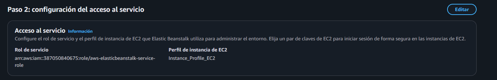

A continuación, se procede a configurar la base de datos con motor PostgreSQL, definiendo las siguientes características principales:

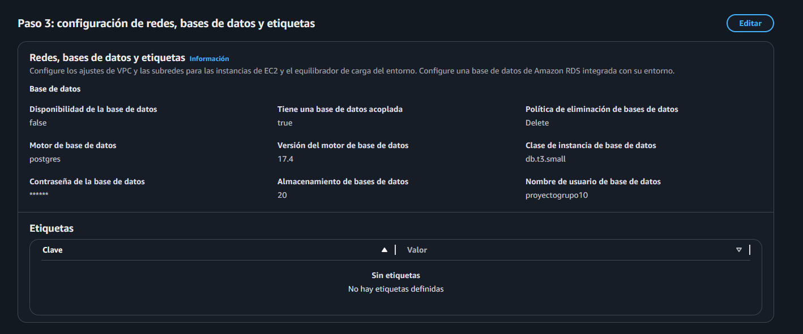

Posteriormente, se configuraron los parámetros de escalado y distribución de tráfico de instancias. En este caso, se habilitó el entorno Equilibrio de carga, el cual utiliza el servicio Auto Scaling de Amazon EC2 para gestionar dinámicamente el tráfico de solicitudes.

El entorno se configuró con un mínimo de 3 instancias EC2 y un máximo de 6, permitiendo así una escala automática basada en la demanda. Esta configuración también se considera dentro de las estrategias de despliegue, con el fin de optimizar la gestión de los batches durante las actualizaciones del entorno.

A continuación, se presentan las configuraciones donde se especifican los rangos de instancias EC2 administrados por el balanceador de carga:

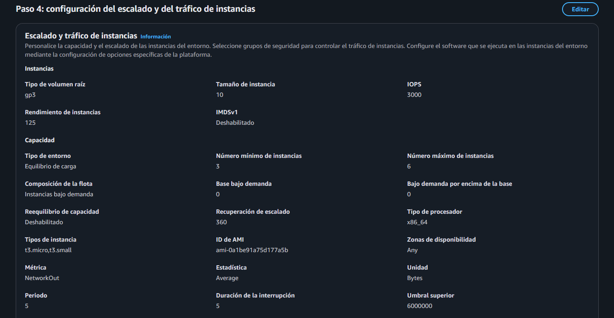

## Punto 1c

Para la configuración de los health checks en AWS Elastic Beanstalk, se define un parámetro dentro del archivo de configuración del entorno `.ebextensions`. En este archivo, se especifica el endpoint de verificación de estado mediante la siguiente instrucción:

```
option_settings:
  aws:elasticbeanstalk:application:
    Application Healthcheck URL: /v1/blacklists/health

  aws:elasticbeanstalk:environment:process:default:
    HealthCheckPath: /v1/blacklists/health
    HealthCheckInterval: 10
    HealthCheckTimeout: 5
    HealthyThresholdCount: 3
    UnhealthyThresholdCount: 5
```

Dentro de la aplicación desarrollada con Flask, se implementa un endpoint `/v1/blacklists/health` que responde con un código HTTP 200, indicando que la aplicación se encuentra desplegada y funcionando correctamente.

A través del archivo `.ebextensions`, se establece la ruta de este endpoint, así como los parámetros asociados a los ciclos de verificación, que incluyen la frecuencia de los chequeos y la tolerancia a errores definida por Elastic Beanstalk para determinar el estado de salud del entorno. A continuación, se presenta el health checker en AWS:

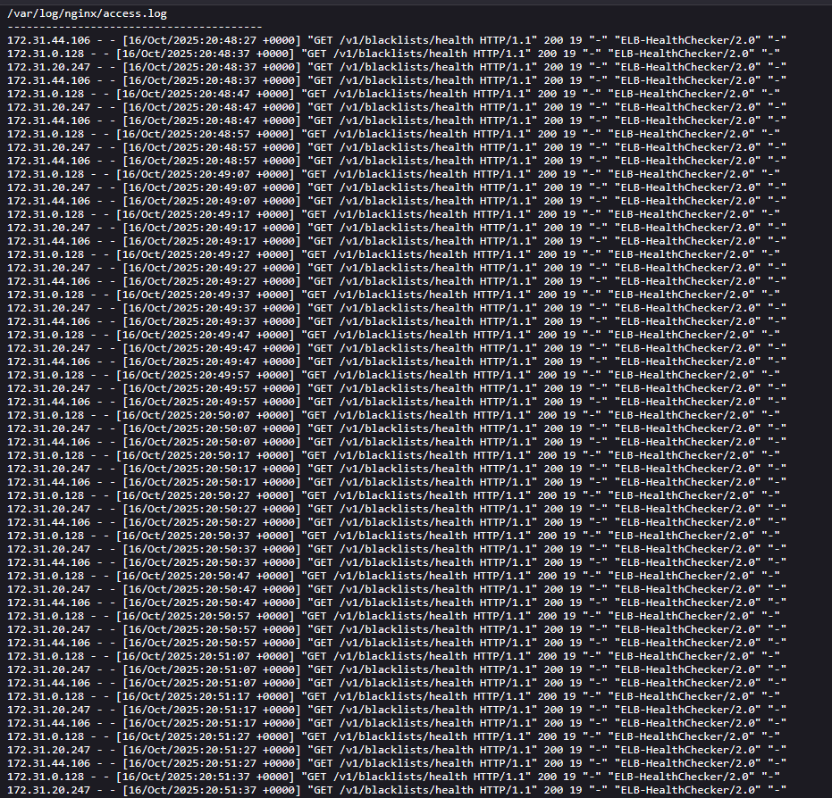

## Rolling with additional batch

### Punto 2a

En cuanto a la cantidad de instancias utilizadas, se configuró un mínimo de tres instancias EC2, las cuales son gestionadas por el Elastic Load Balancer (ELB) para garantizar la disponibilidad del servicio.

Durante la actualización de la aplicación, al implementar una nueva versión del código, se configuró la política de despliegue Rolling with Additional Batch, definida en el archivo de configuración de Elastic Beanstalk de la siguiente manera:

```
aws:elasticbeanstalk:command:
    DeploymentPolicy: RollingWithAdditionalBatch
    BatchSizeType: Fixed
    BatchSize: 3
```

Esta configuración establece que el despliegue se realizará por lotes de tres instancias. Al iniciar la actualización, Elastic Beanstalk crea tres nuevas instancias EC2 que ejecutan la versión más reciente de la aplicación. Estas nuevas instancias deben alcanzar el estado “healthy” antes de que las instancias anteriores sean finalizadas.

En consecuencia, durante el proceso de despliegue coexistieron tres instancias del versionamiento anterior y tres instancias nuevas, completando así el proceso de rolling deployment con additional batch sin interrupción del servicio.

A continuación, se presenta la secuencia del proceso de despliegue al momento de crear el primer lote (batch) de nuevas instancias EC2. Se muestra el mensaje de estado emitido durante la creación de las nuevas instancias, el estado posterior cuando estas alcanzaron el estado “healthy”, así como la notificación de remoción de las instancias anteriores. Finalmente, se detalla el estado operativo de las nuevas y viejas instancias EC2 una vez completado el proceso de despliegue:

#### **Batch nuevo de EC2**
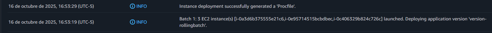

#### **Instancias EC2 a eliminar**


#### **Estado de instancias viejas y nuevas**
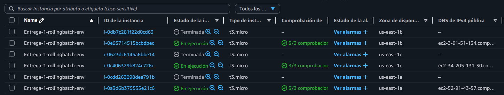

### Punto 2b

Para validar que el despliegue se encontraba en ejecución correctamente, se verificó el estado del aplicativo desde la consola de AWS Elastic Beanstalk, donde se mostró el siguiente mensaje:


Este mensaje indica que el entorno pasó de un estado “Degradado” a “OK”, confirmando que el despliegue se completó satisfactoriamente y que el ambiente estaba operativo y listo para recibir peticiones.

### Punto 2c

El tiempo total del despliegue se puede observar en la siguiente imagen:

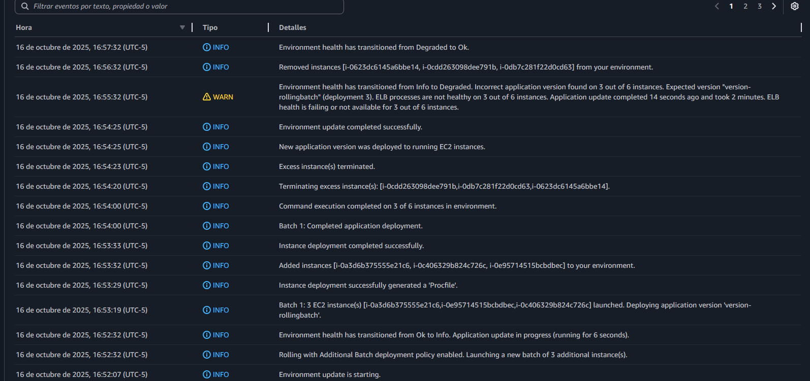

Tal como se evidencia, desde el momento en que se cargó e implementó la nueva versión del código (a las 16:52:07) hasta la finalización del proceso (a las 16:57:32), el despliegue tuvo una duración aproximada de 5 minutos y 25 segundos.

### Punto 2d

En este despliegue se utilizaron nuevas instancias EC2, dado que se empleó una estrategia de implementación de tipo Rolling with Additional Batch.

Una vez las nuevas instancias se encuentran completamente operativas, las instancias antiguas son finalizadas de manera controlada, repitiendo el proceso hasta completar todos los lotes definidos. Por tanto, el despliegue se ejecutó sobre nuevas instancias.

### Punto 2e

En cada punto previo se adjuntaron los pantallazos de AWS con los resultados del despliegue.

### Punto 2f

Este tipo de despliegue crea lotes (batches) del tamaño previamente definido, generando nuevas instancias para cada lote. Elastic Beanstalk mantiene las instancias anteriores en ejecución hasta que las nuevas alcanzan el estado “healthy”, garantizando de esta manera la disponibilidad continua del servicio.

En conclusión, esta estrategia ofrece la gran ventaja de evitar tiempos de indisponibilidad durante el proceso de actualización. Además, proporciona flexibilidad en la configuración de los lotes, permitiendo definir su tamaño tanto de forma fija como mediante un porcentaje específico del total de instancias del entorno.


## Estraegia de despliegue Rolling

A continuación, se va a explicar la estrategia de despliegue Rolling (Continua, como aparece en AWS en español), aplicada al proyecto desplegado en el recurso AWS Elastic Beanstlack. 

Para realizar la configuración de la estrategia de despliegue en el proyecto, como se menciona anteriormente, se configura el archivo app.config con la siguiente información: 

```
aws:elasticbeanstalk:command: 
    DeploymentPolicy: Rolling 
    BatchSizeType: Fixed 
    BatchSize: 1 
```

Inicialmente se muestra la estrategia que va a ser utilizada que en este caso es Rolling. Se define también la forma en la que se van a seleccionar los lotes que serán actualizados, para este caso, vamos a tomar un número fijo, pero también es posible configurar un porcentaje de instancias. Por último, lo que se define es el número de instancias que van a ser actualizadas en cada momento, para este ejemplo, se va a actualizar una instancia a la vez, esto porque, al tener 3 instancias, se garantiza que en cada momento exista más de una instancia en ejecución recibiendo peticiones. 

### Cantidad de instancias utilizadas:

Para poder evidenciar correctamente el funcionamiento de la estrategia de despliegue, se decide hacer uso de la siguiente configuración: 
- Instancias mínimas: 3 
- Instancias máximas: 6

### Despliegue ejecutándose correctamente 

Para poder validar que el despliegue se ejecuta correctamente se tomaron en cuante tres revisiones iniciales, que ayudan a detrminar, de forma progresiva, que el despliegue se realiza correctamente. 

La primera es ver el estado de las instancias desplegadas en la consola de AWS. 

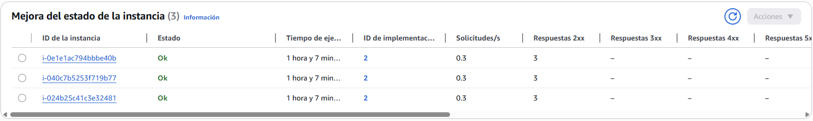

Acá podemos ver el estado de cada una de las instancias y si esta pudo ser desplegada correctamente. De igual forma, podemos ver los logs de la aplicación para corroborar que se desplegó correctamente. 

 

Lo segundo es validar por el dominio asignado al entorno de Elastic Beanstalk, que se puede acceder a las instancias, eso se puede hacer fácilmente por el endpoint dispuesto para validar el estado del despliegue:
```
{{base_url}} /v1/blacklists/health
```

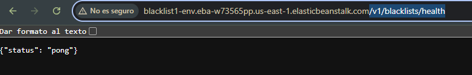

El proceso anterior también ayuda a validar que el balanceador de carga quedó configurado correctamente y esta direccionando bien a las instancias desplegadas. 

Lo siguiente que se hace, es ejecutar las pruebas automatizadas utilizando Postman, esto ya hace una comprobación más completa de que el proyecto se desplegó correctamente y está bien configurado. De igual forma, si algo falla en esta ejecución, se puede deber a un tema de configuración o un error introducido en el código. 

### Despliegue 

Una vez se empieza con el proceso de despliegue, la estrategia va iterando por cada una de las instancias para ir actualizando la versión desplegada:
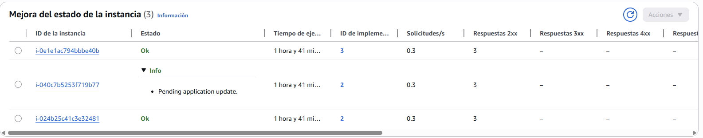

A continuación, se puede observar los estados al inicio del despliegue:
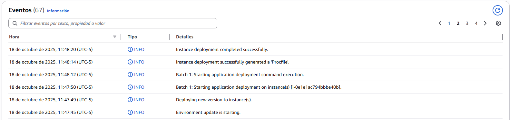

Tiempo total de despliegue: 

Como se puede observar en la siguiente imagen, el despliegue de la nueva versión de la aplicación inicia a las: 11:47:45 (UTC-5) y finaliza a las 11:55:43 (UTC-5), lo que al final se traduce en un tiempo total de despliegue de aproximadamente: 8 minutos. 

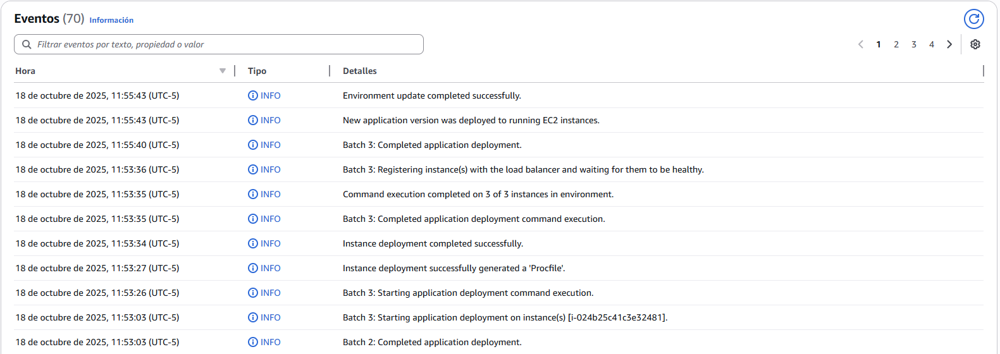

Finalmente, podemos ver que la aplicación se desplegó correctamente con la nueva versión:

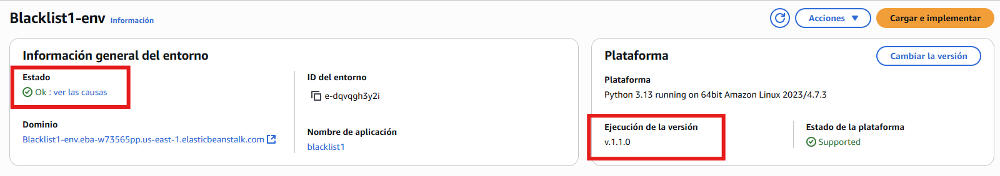

### Formato de despliegue: 

A partir de una revisión previa al despliegue y una posterior al mismo, se encontró que el despliegue se realiza sobre las mismas instancias originales. Lo que se puede observar es que el despliegue toma el número inicial del lote de instancias a actualizar, que en nuestro caso es 1, y va por cada lote, bajando la versión actual, instalando la nueva y dando un tiempo para garantizar que el despliegue se realiza correctamente antes de continuar con el siguiente. 

### Hallazgos 

Esta estrategia de despliegue garantiza que no haya una indisponibilidad del servicio en ningún momento, ya que, si se configura correctamente la cantidad de instancias a actualizar a la vez, siempre habrá instancias disponibles. 

Sin embargo, algo que se nota del despliegue, es que hay momentos en los que conviven ambas versiones de la aplicación. Lo cual puede ser una ventaja, ya que, si en algún punto se introduce un error en la nueva versión, si se detecta antes de terminar el despliegue, se puede deshacer el despliegue para que quede la versión previa.

## Estraegia de despliegue all at once

A continuación, se va a explicar la estrategia de despliegue All at once. 

Para realizar la configuración de la estrategia de despliegue en el proyecto, como se menciona anteriormente, se configura el archivo app.config con la siguiente información: 

```
aws:elasticbeanstalk:command: 
    DeploymentPolicy: AllAtOnce 
```

### 2.a Instancias utilizadas y Estado Inicial

Inicialmente observamos que la aplicación está desplegada en su versión inicial (1.0)

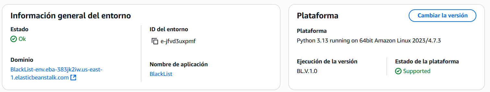

Se encuentra con tres instancias EC2 desplegadas, en estado saludable 

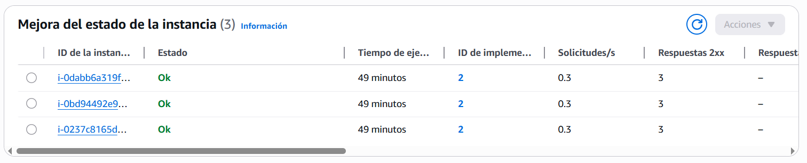

Adicionalmente verificamos que la aplicación está disponible enviando una petición de postman al dominio del entorno

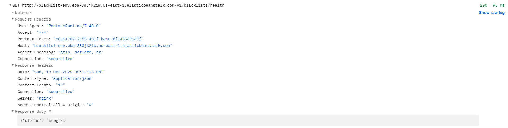


### 2.b Ejecución del despliegue y confirmación

El despliegue de la nueva versión (1.1) se inicia a las 7:45:49 pm tal como se ve en el registro de eventos de la aplicación.

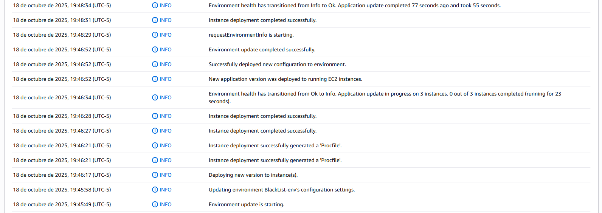

### 2.c Tiempo de ejecución

Como se puede confirmar en la imagen del punto 2.c. El proceso de actualización tomó un total de 2 minutos y 44 segundos, la secuencia se puede apreciar en la imagen pero los principales enventos son:

* A los 45 segundos del lanzamiento el estado de la aplicación cambia de "OK" a "Info"
* A los 63 segundos del lanzamiento, se confirma el despliegue de las instancias EC2
* 2 minutos y 44 segundos después del lanzamiento se confirma que el estado de la aplicación es nuevamente "ok" y se indica que la actualización lanzada hace 77 segundos tomó 55 sengudos en total.

### 2.d Instancias sobre las que se realizó el despliegue

En la siguiente imagen se puede apreciar que la actualización de versión se realiza sobre las mismas instancias de la versión anterior. Pueden validarse los siguientes detalles: 

* El id de las instancia es el mismo que en la imagen del punto 2.a es decir el correspondiente a la versión 1.0
* Se puede apreciar que al momento de tomar el pantallazo se confirma que la actualización se desplegó hace 53 segundos, pero la instancia lleva 59 minutos en ejecución.
* El id de implementación es 3, es decir una implementación por encima de la versión 1.0 mostrada en la imagen 2.a
* Notese que todas las actualizaciónes se dieron "al tiempo" pero con algunos segundos de diferencia.

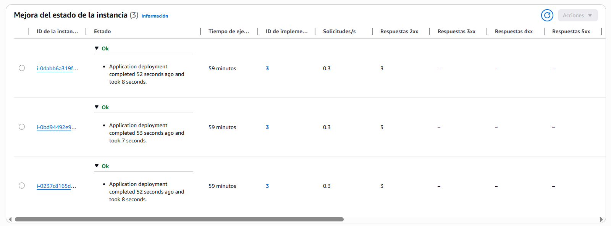


### 2.f Evidencias de la implementación de la nueva versión

Podemos apreciar que la versión 1.1 ya se encuentra desplegada y a las 7:53 pm, 8 minutos después del lanzamiento de la actualización se envía una nueva petición a postman la cual confirma el buen estado de salud de la app

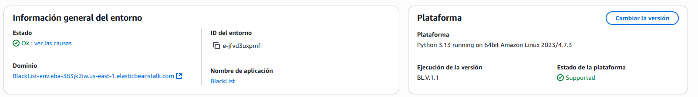

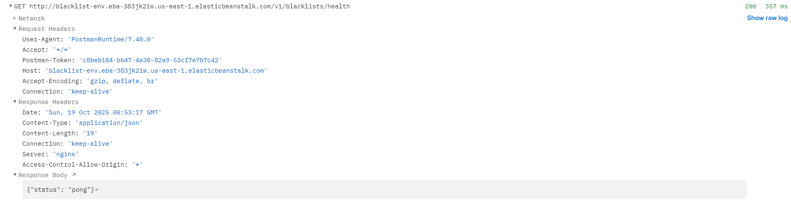


### 2.g Hallazgos

Durante la implementación de esta estrategia de despliegue encontramos que todo se ejecuta de acuerdo a lo esperado. Se da una pequeña interrupción de las instancias cambiando el estado de la aplicación y unos pocos segundos después se confirma el despliegue.

Un punto que llama la atención en esta implementación es que pese a que uno esperaría una breve interrupción de la salud del servicio mientras los contenedores se están actualizando, esto no es perceptible (por lo menos con el tamaño actual de la app y con la forma de verificación  utilizada.)

Se puede ver que los healtcheck disparados durante el proceso de despliegue de la versión (tanto los propios de AWS como dos disparados desde Postman) arrojan siempre status 200 por lo que no es apreciable, como se dijo, una interrupción en el servicio.

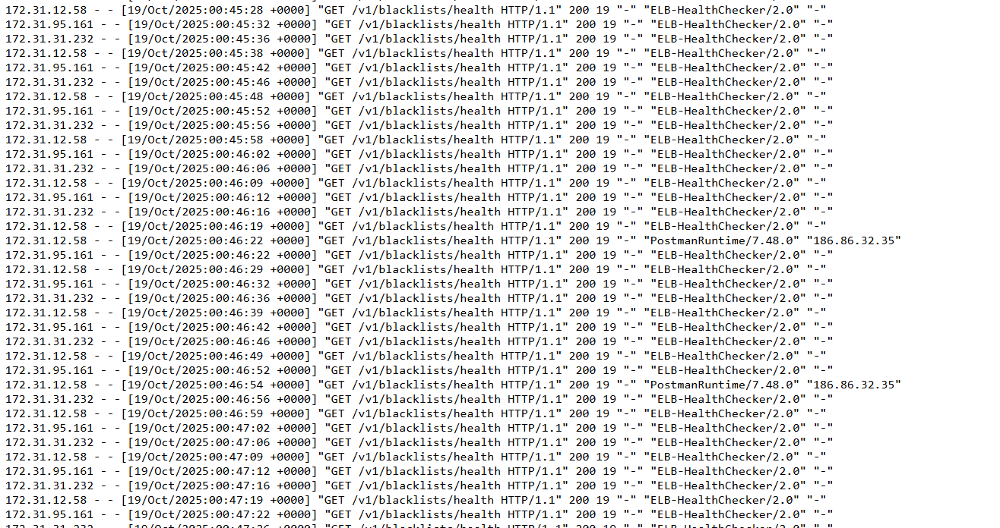