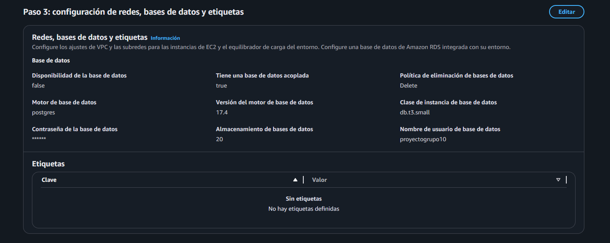
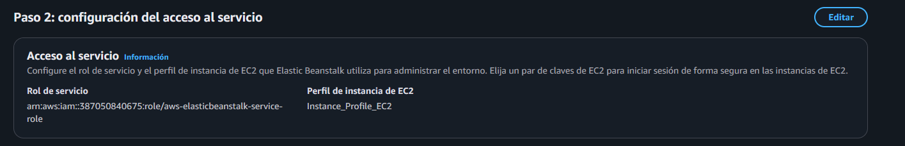
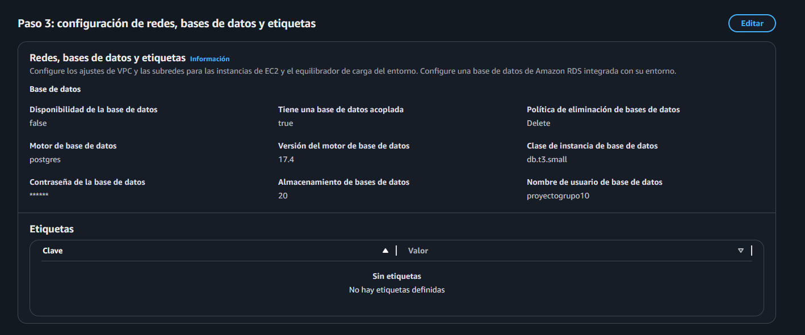
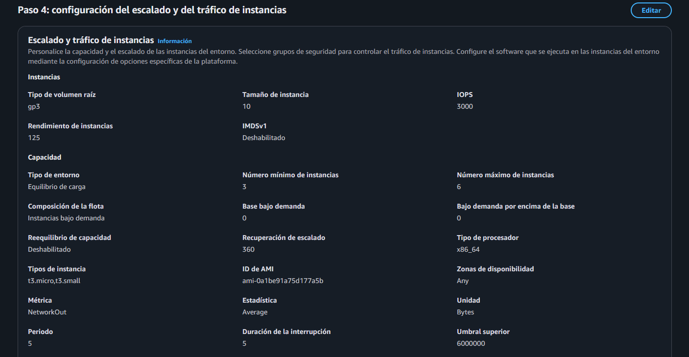
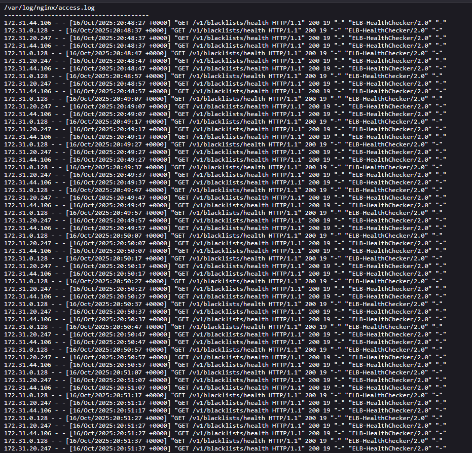

# Documento de entrega I

## Punto 1a
Para la configuración de Amazon RDS dentro del servicio AWS Elastic Beanstalk, durante el proceso de creación del entorno se habilitó la opción correspondiente a RDS, tal como se muestra en la siguiente imagen:



En dicha configuración, se especificó una base de datos con motor PostgreSQL (17.4) y cuando el servicio de AWS Elastic Beanstalk eliminé la aplicación, la base de datos también será eliminada ya que estamos en un entorno de desarrollo y no requerimos guardar instancias de AWS RDS.

Para permitir que la aplicación utilice esta base de datos, dentro del archivo principal de la aplicación `application.py` se definió la conexión mediante variables de entorno, las cuales son generadas automáticamente por Beanstalk al momento de crear el entorno con la instancia de RDS asociada.

En el siguiente fragmento de código se muestra la configuración utilizada para establecer la conexión con la base de datos:

```python
#Creamos la aplicacion de Flask
application = Flask(__name__)

#Ponemos configuraciones de la app
application.config['SQLALCHEMY_DATABASE_URI'] = (
    f"postgresql://{os.getenv('RDS_USERNAME')}:{os.getenv('RDS_PASSWORD')}"
    f"@{os.getenv('RDS_HOSTNAME')}:{os.getenv('RDS_PORT')}/{os.getenv('RDS_DB_NAME')}"
)
```

## Punto 1b

Para la configuración de la aplicación en AWS Elastic Beanstalk, el primer paso consistió en crear y configurar el entorno de ejecución. Este se inicializó como un entorno de tipo “Aplicación de ejemplo”, lo que permite posteriormente cargar el paquete de la aplicación en formato .zip una vez completada la configuración inicial.


Adicionalmente, es importante señalar que la aplicación se ejecuta sobre Python 3.11, tal como se muestra en la configuración del entorno que se ilustra a continuación:


Posteriormente, se configuraron los roles de servicio y los perfiles de instancia de EC2, los cuales permiten a AWS Elastic Beanstalk crear, gestionar y administrar los recursos necesarios para el correcto funcionamiento del entorno de despliegue:



A continuación, se procede a configurar la base de datos con motor PostgreSQL, definiendo las siguientes características principales:



Posteriormente, se configuraron los parámetros de escalado y distribución de tráfico de instancias. En este caso, se habilitó el entorno Equilibrio de carga, el cual utiliza el servicio Auto Scaling de Amazon EC2 para gestionar dinámicamente el tráfico de solicitudes.

El entorno se configuró con un mínimo de 3 instancias EC2 y un máximo de 6, permitiendo así una escala automática basada en la demanda. Esta configuración también se considera dentro de las estrategias de despliegue, con el fin de optimizar la gestión de los batches durante las actualizaciones del entorno.

A continuación, se presentan las configuraciones donde se especifican los rangos de instancias EC2 administrados por el balanceador de carga:



## Punto 1c

Para la configuración de los health checks en AWS Elastic Beanstalk, se define un parámetro dentro del archivo de configuración del entorno `.ebextensions`. En este archivo, se especifica el endpoint de verificación de estado mediante la siguiente instrucción:

```
option_settings:
  aws:elasticbeanstalk:application:
    Application Healthcheck URL: /v1/blacklists/health

  aws:elasticbeanstalk:environment:process:default:
    HealthCheckPath: /v1/blacklists/health
    HealthCheckInterval: 10
    HealthCheckTimeout: 5
    HealthyThresholdCount: 3
    UnhealthyThresholdCount: 5
```

Dentro de la aplicación desarrollada con Flask, se implementa un endpoint `/v1/blacklists/health` que responde con un código HTTP 200, indicando que la aplicación se encuentra desplegada y funcionando correctamente.

A través del archivo `.ebextensions`, se establece la ruta de este endpoint, así como los parámetros asociados a los ciclos de verificación, que incluyen la frecuencia de los chequeos y la tolerancia a errores definida por Elastic Beanstalk para determinar el estado de salud del entorno. A continuación, se presenta el health checker en AWS:



## Rolling with additional batch

### Punto 2a

En cuanto a la cantidad de instancias utilizadas, se configuró un mínimo de tres instancias EC2, las cuales son gestionadas por el Elastic Load Balancer (ELB) para garantizar la disponibilidad del servicio.

Durante la actualización de la aplicación, al implementar una nueva versión del código, se configuró la política de despliegue Rolling with Additional Batch, definida en el archivo de configuración de Elastic Beanstalk de la siguiente manera:

```
aws:elasticbeanstalk:command:
    DeploymentPolicy: RollingWithAdditionalBatch
    BatchSizeType: Fixed
    BatchSize: 3
```

Esta configuración establece que el despliegue se realizará por lotes de tres instancias. Al iniciar la actualización, Elastic Beanstalk crea tres nuevas instancias EC2 que ejecutan la versión más reciente de la aplicación. Estas nuevas instancias deben alcanzar el estado “healthy” antes de que las instancias anteriores sean finalizadas.

En consecuencia, durante el proceso de despliegue coexistieron tres instancias del versionamiento anterior y tres instancias nuevas, completando así el proceso de rolling deployment con additional batch sin interrupción del servicio.

A continuación, se presenta la secuencia del proceso de despliegue al momento de crear el primer lote (batch) de nuevas instancias EC2. Se muestra el mensaje de estado emitido durante la creación de las nuevas instancias, el estado posterior cuando estas alcanzaron el estado “healthy”, así como la notificación de remoción de las instancias anteriores. Finalmente, se detalla el estado operativo de las nuevas y viejas instancias EC2 una vez completado el proceso de despliegue:

#### **Batch nuevo de EC2**


#### **Instancias EC2 a eliminar**


#### **Estado de instancias viejas y nuevas**


### Punto 2b

Para validar que el despliegue se encontraba en ejecución correctamente, se verificó el estado del aplicativo desde la consola de AWS Elastic Beanstalk, donde se mostró el siguiente mensaje:


Este mensaje indica que el entorno pasó de un estado “Degradado” a “OK”, confirmando que el despliegue se completó satisfactoriamente y que el ambiente estaba operativo y listo para recibir peticiones.

