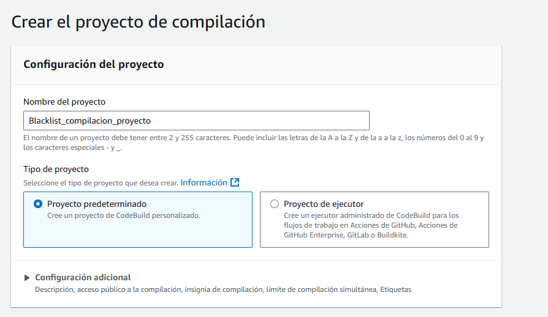
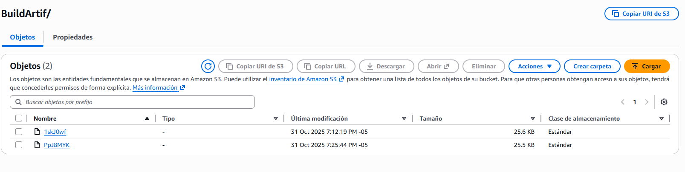

# Implementación Pipeline de Integración Continua

## Caso Pipeline Exitoso

En este caso ejecutaremos la construcción de la aplicación blacklist en un entorno de Elastic Beanstalk a través de un pipeline configurado en Amazon Codepipeline. 

La idea del ejercicio es que durante la construcción inicial de la aplicación así como despues de ejecutar un commit, las pruebas se ejecuten automáticamente, los test pasen y la aplicación se construya correctamente. 

Esperamos que al finalizar la construcción se genere un artefacto (en el bucket de s3) con la aplicación construida a partir del repositorio fuente.

### Preparación del ejercicio

Para ejecutar este ejercicio contamos con: 

Un fork del repositorio original de la aplicación *BlacList* en la cuenta de github desde la cual se van a realizar las pruebas. Esto nos facilita la conexión pues genera una copia de la aplicación desde la cual tenemos un rol de propietario.


Una conexion con el repositorio de github desde el cual se van a realizar las pruebas. Configurada desde Amazon Codepipeline


### Ejecucion del ejercicio

Para iniciar con el ejercicio vamos a Amazon Codepipeline, seleccionamos la opción **crear canalización** e iniciamos con la configuración.

Llamamos nuestra canalización *BlackList_Pipeline*


El paso a seguir es la definición del origen del pipeline para lo cual utilizamos el proveedor GitHub (a través de Github app), la [conexión](#preparación-del-ejercicio) previamente configurada y el repositorio habilitado mediante la conexión. 


Posteriormente, en el mismo proceso de creación de la canalización, creamos un proyecto de compliación de amazon Codebuild llamado *Blaclists_compilacion_proyecto* 



En el proyecto de compilación  utilizamos un archivo de especificación de compilación (que ya está creado en el proyecto de Github) el cual se llama buildspect.yml. Ingresamos la ruta relativa del archivo de especificación.


Una vez creado el proyecto, se termina de configurar la compilación con el proyecto creado.


Para este ejercicio se omitieron las etapas de pruebas y de despliegue. 

Una vez finalizada la configuración, se lanzó la construcción del Pipeline.

Podemos validar que tanto la habilitación de los recursos como la construcción de la aplicación fueron exitosos.

Nótese que la fuente del recurso es "build pipeline" que es el nombre del commit del repositorio con el que se hizo la construcción inicial.


Podemos validar que en la etapa de construcción las pruebas se ejecutaron de forma exitosa.


El siguiente paso es hacer un commit en el repositorio fuente. El commit se llamó "commit 1 pipeline" para probar ahora que la ejecución del push a la rama main del repositorio fuente desencadene una nueva ejecución del proceso de construcción. 

Podemos validar que una vez hecho el nuevo commit, el pipeline inicia una nueva ejecución encima de la ejecución de la construccion inicial (build pipeline), ahora con el nombre del commit


Una vez finalizada, validamos que la segunda ejecución (la del commit 1) también fue exitosa


Validamos también que se ejecutaron las pruebas nuevamente


podemos confirmar en S3 que se generaron 2 artefactos, uno para la ejecución inicial y uno para el commit realizado



Al descargar el artefacto, podemos confirmar que este contiene la aplicación construida.


Con esto concluye el ejercicio exitoso de integración continua.


## Caso Pipeline Fallido

### Preparación del ejercicio

Para la preparación de este ejercicio, la implementación y configuración del pipeline se mantiene igual que en el caso exitoso. No se realiza ningún cambio con respecto a la configuración vista previamente, ya que para generar un caso fallido se utiliza un enfoque diferente, que será explicado a continuación.

---

Debido a que para que el pipeline se ejecute correctamente, es necesario primero ejecutar los test unitarios de la aplicación, lo cual viene definido por el archivo de especificación de compilación (buildspect.yml), en su etapa de pre-build, la cual sería un requisito para genearar el artefacto:

```yaml
  pre_build:
    commands:
      - cd blacklist_app
      - export PYTHONPATH=.
      - python -m pip install --upgrade pip
      - pip install -r requirements.txt
      - pytest tests/ -v
```

Como se aprecia en el anterior blo que, se ejecutan los test de toda la aplicación, en caso de que falle alguno, el proceso de construcción fallaría y no se generaría el artefacto.

Por lo tanto, para generar un caso fallido, lo que se propuso fue hacer que algún commit a la rama main del repositorio, llevará un error en algún test unitario de la aplicación, como se podrá apreciar en el siguiente bloque:

```python
def test_get_email_success(app, mocker):
    #Mock JWT verification
    mocker.patch('flask_jwt_extended.view_decorators.verify_jwt_in_request')
    
    # Mock the blacklist_crud.getEmailFromBlacklist method
    mock_response = {
        'found': True,
        'email': 'test@example.com',
        'appId': '123e4567-e89b-12d3-a456-426614174000',
        'blockedReason': 'Test reason',
        'createdAt': '2023-01-01T00:00:00',
        'ipAddress': '192.168.1.1'
    }
    
    mocker.patch('app.services.blacklist_crud.BlacklistCRUD.getEmailFromBlacklist', return_value=mock_response)
    
    with app.test_request_context(
        '/v1/blacklists/test@example.com',
        method='GET',
    ):
            resource = BlacklistGetEmail()
            response, status_code = resource.get('test@example.com')
            
            assert status_code == 400 # Originalmente se espera un 200
            assert response == mock_response
```

En el anterior bloque se muestra el test unitario que se propuso modificar para generar un caso fallido. En este caso, se cambia el valor esperado del status code de 200 a 400, lo cual haría que el test falle y por ende, el pipeline también fallaría al ejecutarlo.

### Ejecución del ejercicio

Para lograr que el pipeline previamente configurado empiece a ejecutarse, se hace un commit al repositorio, ya sea directamente a la rama main o a una rama secundaria y luego haciendo un Pull Request a la rama main.

Podemos validar que una vez hecho el nuevo commit, el pipeline inicia una nueva ejecución encima de la ejecución de la construccion inicial (build pipeline), ahora con el nombre del commit


En la información proporcionada por CodeBuild, podemos ver el detalle de la ejecución y el error por el cual falla la construcción del artefacto.


Igualmente, podemos también ver los logs o registros de la ejecución del pipeline para identificar de mejor el motivo por el cual falla la construcción del artefacto.


Se puede apreciar que el error viene por un fallo en el test unitario que se modificó.

Finalmente, se puede observar que el pipeline queda en estado de fallido, lo cual implica que no se generó el artefacto en S3.


Acá da opciones para reintentar manualmente la ejecución del pipeline, sin embargo, en este caso puntual la única forma de hacer que el pipeline funcione correctamente es ajustando localmente los test que estén fallando y hacer un nuevo commit al repositorio fuente con la correción.