## Pipeline de Integración Continua Fallida

### Punto de partida

Nuestro punto de partida es una canalización correctamente configurada y funcionando

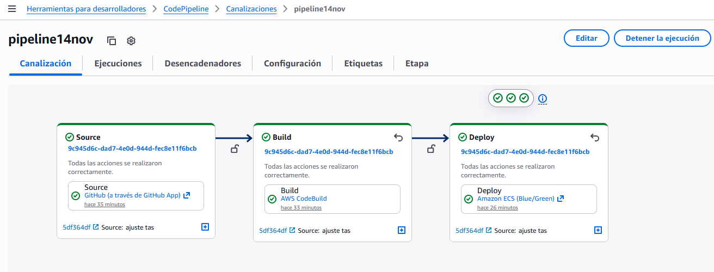

La canalización inicial es del 14 de noviembre a las 10:22 pm como se ve en la siguiente imagen

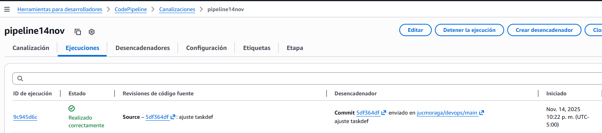

### Ejercicio CI Fallida

Para realizar un ejercicio de integración fallida, vamos a "corromper" uno de los test que es el test get_email_not_found el cual espera una respuesta con código 404 (se modificó por 4040) 

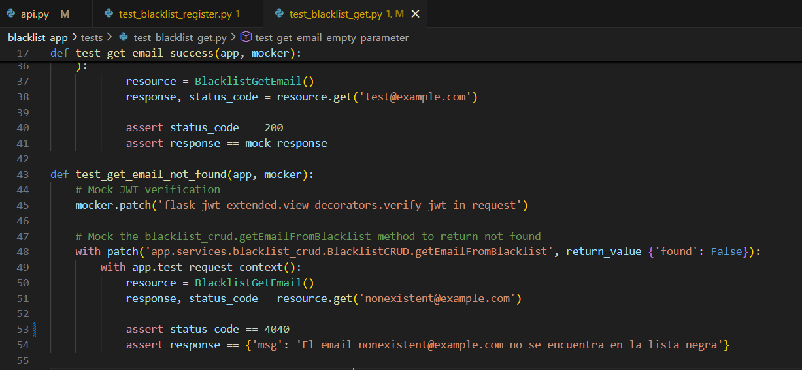

Realizamos el commit con el cambio realizado en el código y lo titulamos "Prueba fallo"

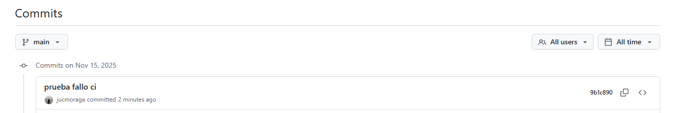

Podemos verificar que el push desencadenó una nueva ejecución del pipeline, podemos ver que en el campo "Revisiones del código fuente" se puede ver el código y el título del commit que acabamos de ejecutar en github.

En este caso el estado de la ejecución es "Error"

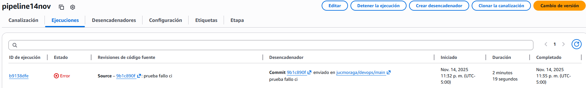

Podemos ver que la integración falló y por lo tanto no se inició el despliegue.

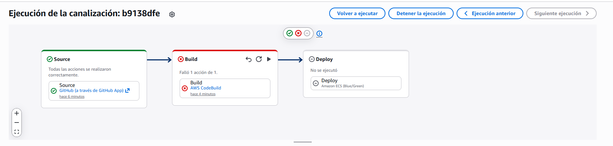

En los registros de compilación se puede apreciar que el test get_email_not_found (el mismo que acabamos de alterar para el ejemplo) falló, pues retornó 404 cuando estabamos "esperando" 4040.

Esta es la razón por la que se interrumpió la integración.

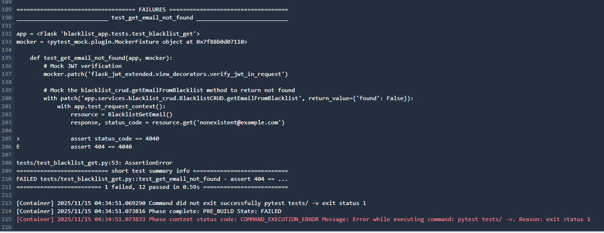

Con esto finaliza el ejercicio de integración continua fallido.

## Pipeline de Integración Continua Exitosa y Entrega Continua Exitosa

### Punto de partida

Para mostrar un ejercicio de integración y despliegue exitosos, que además cambia el estado del pipeline a partir de ajustes en el código, nuestro punto de partida será el ejercicio anterior en el cual tenemos una canalización bien configurada, pero que no se desplegó de forma exitosa por que falló la integración y por lo tanto no se ejecutó el despliegue.


### Ejercicio Integración y Entrega Exitosos

Como ya sabemos, la integración falla porque el test get_email_not_found está fallando. Procedemos a corregirlo y a realizar un commit al repositorio titulado "corrección integracion".

Podemos apreciar que el commit ajusta nuevamente la linea que estaba dañada del test.

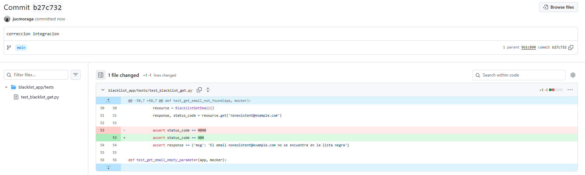

Podemos apreciar que después de la integración fallida, el nuevo commit de corrección (con el mismo título y código que en github) inició una nueva ejecución.

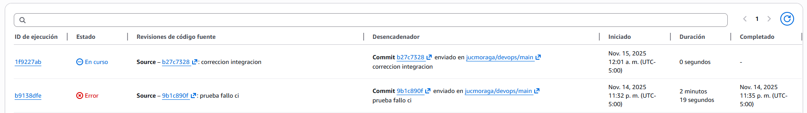

Una vez hecha la corrección, la integración fue exitosa y por lo tanto el pipeline procedió a la etapa de despliegue 

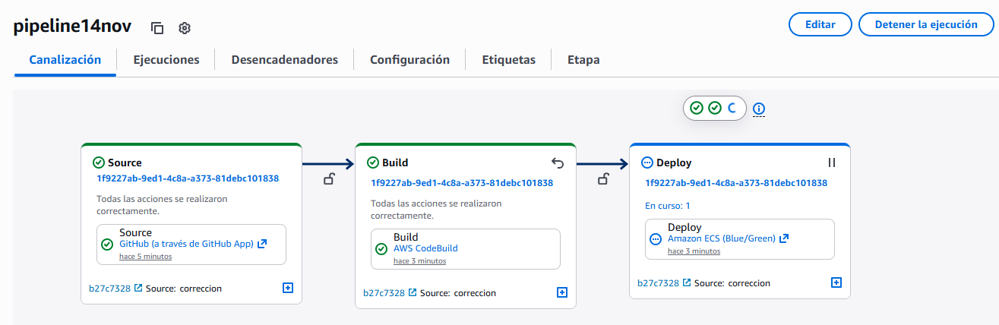

En la ejecución del despliegue vemos que las tareas de sustitución se ejecutaron correctamente y que el trafico ya fué redireccionado a la nueva versión. 

Se da un tiempo de espera de estabilización de 5 minutos (de acuerdo a lo que hemos venido definiendo en la configuración del proyecto de compilación) antes de apagar la versión anterior y finalizar el despliegue. 

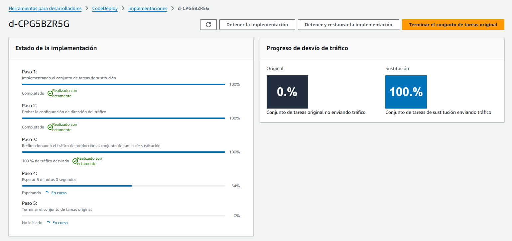

Pasados unos minutos vemos que nuestro commit de corrección fue completamente exitoso tanto en integración como en entrega y que estableció el estado de ejecución correcta de nuestro pipeline. 

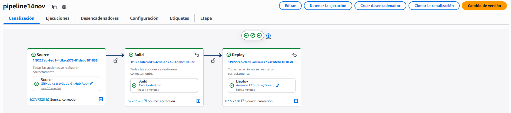

Evidenciamos que el 15 de noviembre a las 00:03 am (hora de ejecución del pipeline) se generó un BuildArtifact

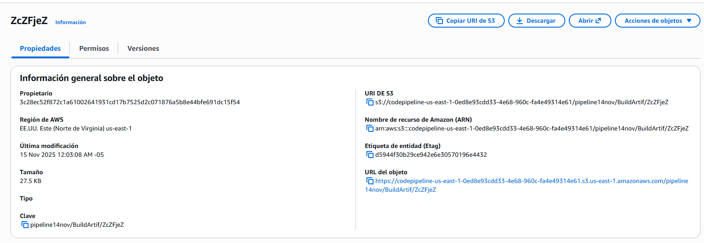

Al descargar y abrir el artefacto, encontramos la aplicación correctamente construida.

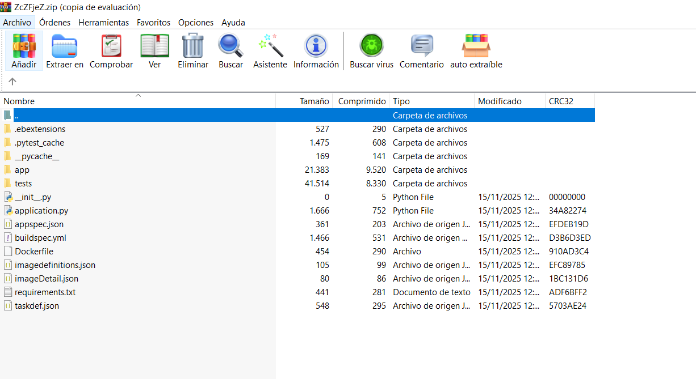

Por ultimo y para verificar el correcto funcionamiento de todo el despligue, ejecutamos desde postman las pruebas del aplicativo, apuntando a nuestro balanceador de carga 

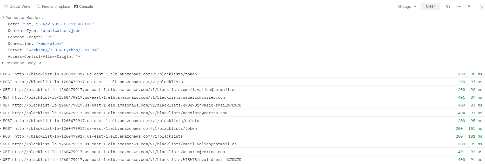


## Pipeline de Integración Continua exitoso y de entrega continua fallido

Para provocar que la ejecución del pipeline tenga una integración continua exitosa pero una entrega continua fallida, se modificará el archivo `buildspec.yml`, específicamente en la sección correspondiente a los artefactos. Actualmente, el archivo está definido de la siguiente manera:

```
artifacts:
  base-directory: blacklist_app
  files:
    - '**/*'
    - imagedefinitions.json
    - imageDetail.json
  secondary-artifacts:
    DefinitionArtifact:
      files:
        - appspec.yaml
        - taskdef.json
    ImageArtifact:
      files:
        - imageDetail.json
```

La línea `base-directory: blacklist_app` indica que los artefactos deben empaquetarse a partir de ese directorio y luego ser almacenados en el bucket s3 generado por defecto. La modificación consiste en eliminar dicha declaración de `base-directory`, de modo que el empaquetado de los artefactos se realice desde la raíz del repositorio. Como resultado, los archivos `taskdef.json` y `appspec.json`, que contienen la definición del task de ECS y del servicio de ECS a crear, no estarán disponibles para CodeDeploy. Esto provocará que la fase de despliegue falle dentro del pipeline.

Al realizar este cambio y hacer push al repositorio, el pipeline se activará automáticamente. El resultado de dicha ejecución se presenta a continuación:

### Fallo pipeline
![pipeline]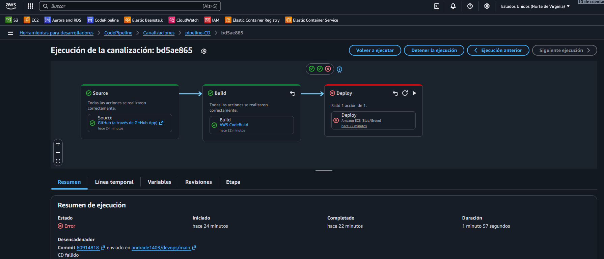

### Razón fallo pipeline
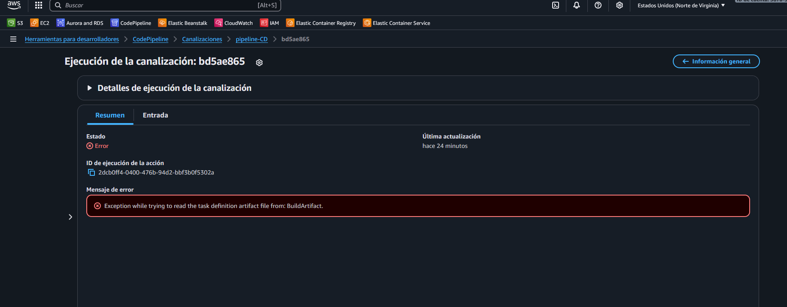

Como se puede evidenciar, la causa del fallo fue una excepción generada durante la ejecución del pipeline: este intentó leer el archivo `taskdef.json` generado en el bucket, pero al no encontrarlo, detuvo el proceso y marcó la fase de despliegue como fallida.

Para evidenciar lo anterior, en el bucket s3 generado por defecto se creó el artefacto correspondiente a la última ejecución, registrado a las 5:15 p.m.

### Bucket s3 con artefacto
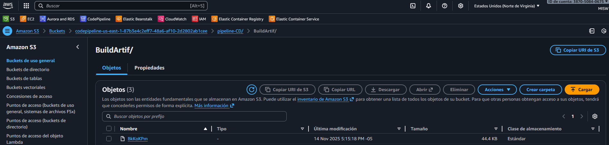

Al descargar dicho artefacto, se obtuvo el siguiente contenido:

### Artefacto generado
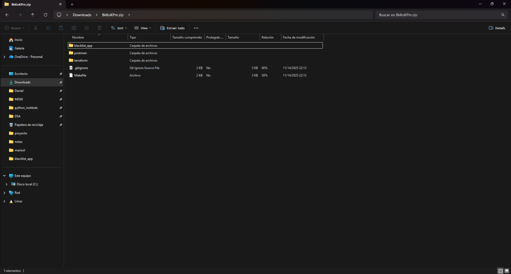

Al no encontrarse los archivos `taskdef.json` y `appspec.json`, ni la definición del task ni la del servicio pueden ejecutarse en ECS. En consecuencia, el despliegue continuo falla durante su implementación.

## Links de referencia
- Video: https://uniandes-my.sharepoint.com/:v:/g/personal/d_andrades_uniandes_edu_co/IQBlmYsNVJ2ET4UO-x876HC_AeFuXthqIUK6OkAAU8c28p4
- Repositorio: https://github.com/andrade1403/devops.git
- Colección POSTMAN: https://documenter.getpostman.com/view/49127146/2sB3QMLpC6
