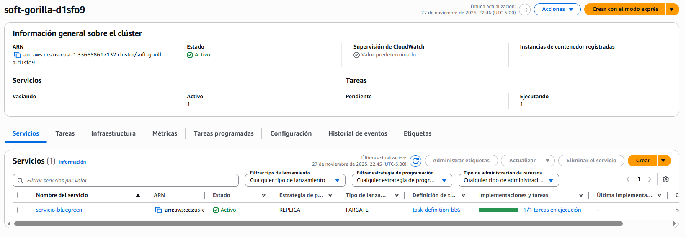
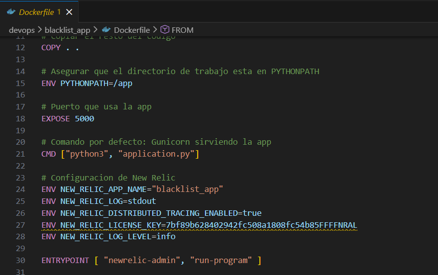
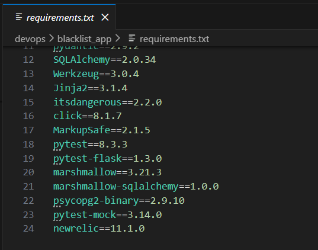
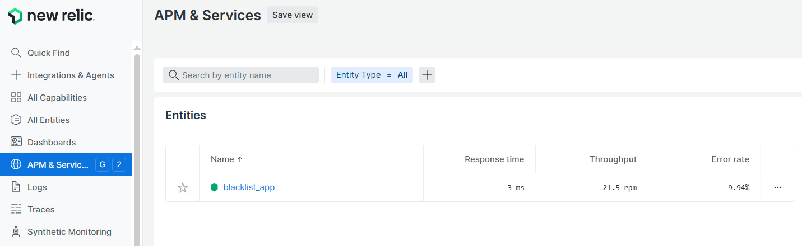
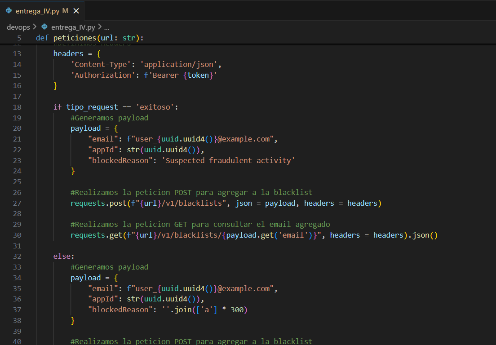
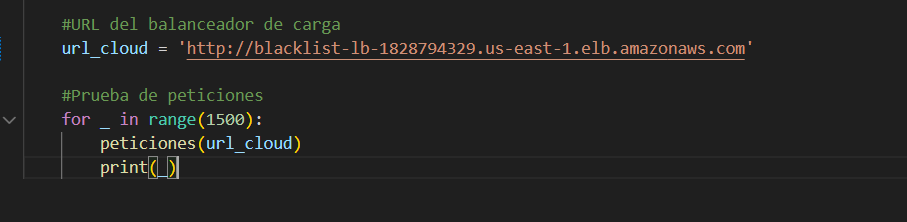

# Documentación Monitoreo Continuo con New Relic

## Contexto: Preparación de la aplicación y la prueba de estrés

### Configuración de la aplicación y el servicio de monitoreo

Para realizar la prueba de estrés se desplegó la aplicación BlackList en la misma infraestructura utilizada para los ejercicios de despliegue continuo, tal como se venía trabajando. Es decir se configuró un balanceador de carga con dos target group asociados y se creó un cluster en Elastic Container Service el cual tiene una tarea definida apuntando al repositorio (ECR) donde está la imagen de la aplicación y un servicio configurado para correr la aplicación en EC2 a través del balanceador de carga previamente creado. 

Un cambio relevante que tiene la imagen de la aplicación, almacenada en Elastic Container Registry es que en esta oportunidad el dockerfile utilizado para construir la imagen tiene configuradas las variables de entorno propias de la cuenta de New Relic, tales como el nombre de la aplicación en New Relic y la llave para acceder al servicio en NR 

Así mismo, se configuró la librería newrelic 11.1.0 dentro de los requirements de la imagen de la aplicación.

En el listado de entidades de la sección APM & Servicios de NR podemos ver que la aplicación blacklist_app se encuentra activa (esto lo es lo que indica el hexagono verde) por lo cual podemos comprobar que la aplicación desplegada en AWS está reportando al servicio de monitoreo.

**Como dato adicional:** El video de sustentación de la entrega y la documentación de las pruebas de estres se hicieron con despliegues distintos de la aplicación, aunque se usó la misma imagen base y el mismo servicio de monitoreo. Con este ejercicio comprobamos que la misma configuración del servicio de monitoreo sirve para diferentes despliegues. El servicio de monitoreo se puede "reusar" entre distintos despliegues de la aplicación y se muestra inactivo cuando la aplicación no está desplegada en ninguna infraestructura. 

## Estructura de la prueba. 

La prueba se realizó con un script de Python. 

El script básicamente obtiene un token de autorización de la aplicación, y una vez obtenido lo utiliza para armar y disparar una petición.

La petición puede ser aleatoriamente una petición correcta o una petición con error (que viola intencionalmente la restricción del tamaño del campo blockedReason)

Finalmente se apunta al balanceador de carga y se dispara un conjunto de peticiones en bucle (en este caso mil quinientas)

Los resultados de la prueba los veremos a continuación.

## 1. Capacidades de monitoreo de desempeño a nivel de aplicación

## Links de referencia
- Video: https://uniandes-my.sharepoint.com/:v:/g/personal/d_andrades_uniandes_edu_co/IQAHKH8gq0jfQo1smJmv8KLZASAL56Hb-Y28ffiXBZ6RTmc
- Repositorio: https://github.com/andrade1403/devops.git
- Colección POSTMAN: https://documenter.getpostman.com/view/49127146/2sB3QMLpC6
