# Documentación Monitoreo Continuo con New Relic

## Contexto: Preparación de la aplicación y la prueba de estrés

### Configuración de la aplicación y el servicio de monitoreo

Para realizar la prueba de estrés se desplegó la aplicación BlackList en la misma infraestructura utilizada para los ejercicios de despliegue continuo, tal como se venía trabajando. Es decir se configuró un balanceador de carga con dos target group asociados y se creó un cluster en Elastic Container Service el cual tiene una tarea definida apuntando al repositorio (ECR) donde está la imagen de la aplicación y un servicio configurado para correr la aplicación en EC2 a través del balanceador de carga previamente creado. 

Un cambio relevante que tiene la imagen de la aplicación, almacenada en Elastic Container Registry es que en esta oportunidad el dockerfile utilizado para construir la imagen tiene configuradas las variables de entorno propias de la cuenta de New Relic, tales como el nombre de la aplicación en New Relic y la llave para acceder al servicio en NR 

Así mismo, se configuró la librería newrelic 11.1.0 dentro de los requirements de la imagen de la aplicación.

En el listado de entidades de la sección APM & Servicios de NR podemos ver que la aplicación blacklist_app se encuentra activa (esto lo es lo que indica el hexagono verde) por lo cual podemos comprobar que la aplicación desplegada en AWS está reportando al servicio de monitoreo.

**Como dato adicional:** El video de sustentación de la entrega y la documentación de las pruebas de estres se hicieron con despliegues distintos de la aplicación, aunque se usó la misma imagen base y el mismo servicio de monitoreo. Con este ejercicio comprobamos que la misma configuración del servicio de monitoreo sirve para diferentes despliegues. El servicio de monitoreo se puede "reusar" entre distintos despliegues de la aplicación y se muestra inactivo cuando la aplicación no está desplegada en ninguna infraestructura. 

## Estructura de la prueba. 

La prueba se realizó con un script de Python. 

El script básicamente obtiene un token de autorización de la aplicación, y una vez obtenido lo utiliza para armar y disparar una petición.

La petición puede ser aleatoriamente una petición correcta o una petición con error (que viola intencionalmente la restricción del tamaño del campo blockedReason)

Inmediatamente después de creado el email en la lista negra, este es consultado, así logramos que la petición abarque ambas funcionalidades de la Blacklist.

Finalmente se apunta al balanceador de carga y se dispara un conjunto de peticiones en bucle (en este caso mil quinientas)

Los resultados de la prueba los veremos a continuación.

## 1. Capacidades de monitoreo de desempeño a nivel de aplicación

Al abrir el servicio de monitoreo de la aplicación en New Relic lo primero que observamos es la sección "Summary". Esta sección cuenta con los gráficos más importantes del monitoreo: Tiempo de respuesta, Rendimiento, Apex Score e Indice de errores.

Aquí podemos ver que para este ejercicio, la aplicación se levantó sobre las 10:00 pm, las pruebas (1500 peticiones aleatorias a la blacklist) se iniciaron sobre las 10:11pm y finalizaron al rededor de las 10:37 pm.

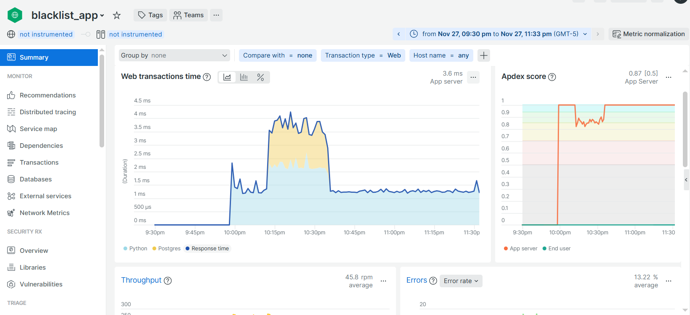

Una de las funcionalidades importantes que encontramos en la aplicación es el *View Query* que permite personalizar consultas para ver rangos de tiempo o servicios específicos. Esto es de gran utilidad para poder limpiar los resultados. Por ejemplo en este caso utilizamos la consulta para poder ver únicamente los resultados en el intervalo de tiempo que se realizó la prueba que se está documentando en este ejercicio.

En la siguiente gráfica podemos ver el tiempo de respuesta total de la aplicación, el cual es el resultado de la suma del tiempo de respuesta del microservicio de python y la base de datos de postgres. 

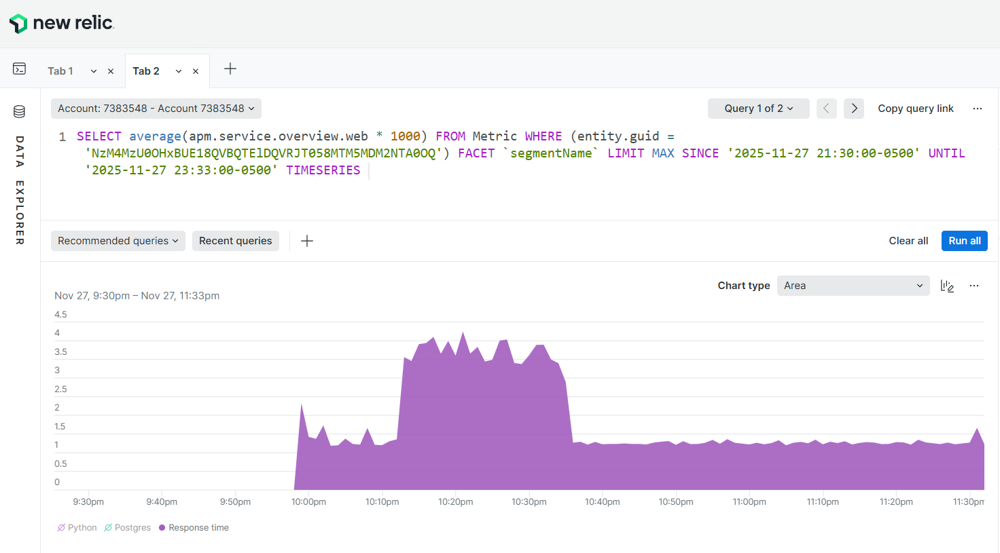

En la imagen anterior podemos ver que la aplicación está generando constantemente respuestas de 1 milisegundo (esto corresponde al estado de comprobación de salud del servicio). 

También podemos apreciar que durante la ejecución de las 1500 peticiones, la aplicación tuvo un tiempo medio de respuesta medio de 3.5 a 4 milisegundos con un pico de 4.24ms a las 10:21 pm

Ahora ajustando un poco la configuración de la presentación (con las opciones de la esquina inferior izquierda) podemos separar el tiempo de respuesta entre el tiempo de la base de datos (Postgres) y el microservicio (Python), como se ve en la imagen siguiente.

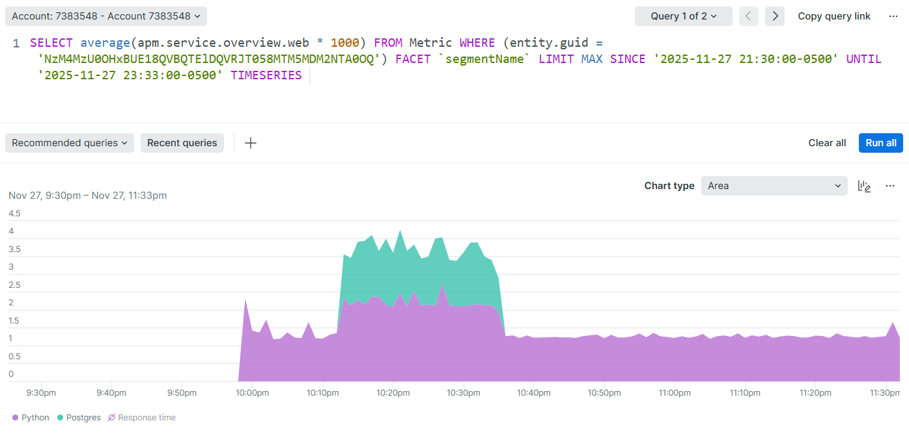

### Tiempo de respuesta de la aplicación: 

Enfoncandonos en el tiempo de respuesta de la aplicación, vemos que el microservicio tiene un tiempo de respuesta promedio de 1 ms para la comprobación de estado de salud y que este tiempo de respuesta pasa a 2ms durante la ejecución de peticiones. 

El tiempo de respuesta máximo se registró a las 10:27 pm y fue de 2.73 ms.

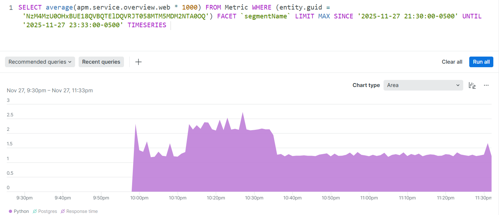

Otra forma de ver los tiempos de respuesta de la aplicación es a través de la opción "Transactions" la cual desglosa el tiempo de respuesta total entre las transacciones realizadas.

Aquí podemos ver que el 57% del tiempo de respuesta total fue consumido por la transacción de registro (la que ejecuta registros del email en la lista negra)

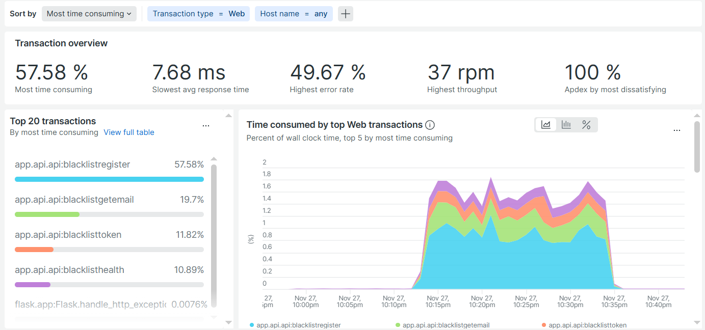

### Tiempo de respuesta de la base de datos

Enfocandonos en la base de datos, vemos que esta no tuvo actividad durante las peticiones de estado de salud (lógicamente) sino unicamente durante la ejecución de las pruebas. 

Tenemos un tiempo de respuesta de entre 1.2 y 1.8 ms. El tiempo de respuesta máximo fue de 1.87 ms.

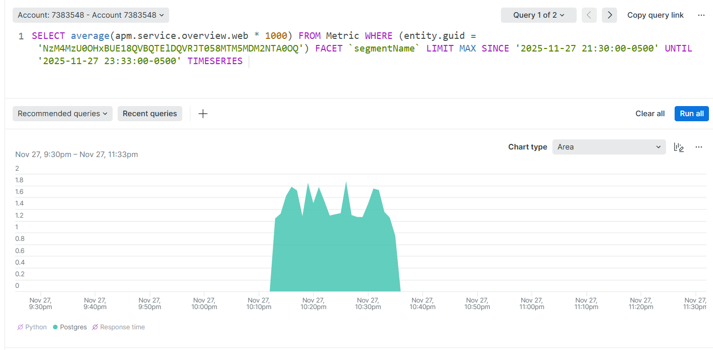

Otra forma de ver los tiempos de respuesta de la base de datos (también del microservicio) es a través de la opción "Breakdown Table". Aquí podemos apreciar por ejemplo las diferencias en los tiempos de respuesta de la base de datos dependiendo del tipo de transacción. Vemos que las transacciones de consulta SELECT tiene un tiempo de respuesta mayor (1.8ms promedio) que las instrucciones de escritura COMMIT e INSERT (1.0 y 0.8 ms).

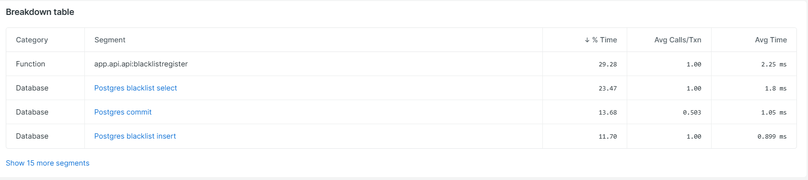

## 2. Capacidades de Monitoreo del Apdex

### ¿Qué es? 

Se puede definir como un estándar en observabilidad, relacionado con los SLA, que sirve para medir la satisfacción de los usuarios, a partir de los tiempos de respuesta de la aplicación. 

Se clasifica cada respuesta de la aplicación en diferentes categorías, según el tiempo de respuesta de la siguiente forma: 

- Satisfecho: Una respuesta satisfactoria es la que se responde dentro del tiempo establecido en el umbral Apdex. 

- Tolerado: Cuando el tiempo de respuesta de aplicación, es mayor al umbral Apdex, pero menor a 4 veces ese valor, entra en el área de solicitudes toleradas. 

- Frustrado: Cuando el tiempo de respuesta supera 4 veces el valor del umbral, sería una solicitud frustrada. 

A partir de la clasificación anterior, se puede encontrar el valor del Apdex de la aplicación en una ventana de tiempo definida generalmente en minutos. Es importante mencionar que para poder determinar el Apdex, se necesita una aplicación que soporte al menos 100 RPM, para que los resultados sean fieles a la realidad. 

De esta forma, se puede determinar el Apdex con la siguiente fórmula: 

(S + T/2)/Total 

Donde S = número de peticiones satisfechas, T = número de peticiones torelables y Total = número total de peticiones. 

 

Esto dará un valor entre 0 y 1, donde 0 sería el peor valor y un 100% de peticiones frustradas y 1 sería un 100% de peticiones satisfechas. 

 
Teniendo ya una idea de lo que es el Apdex y lo que mide en New Relic, se procederá a explicar la forma de hacerle seguimiento.

Se puede encontrar una gráfica de Apdex, en la sección de APM & Service, en el apartado de SLAs:

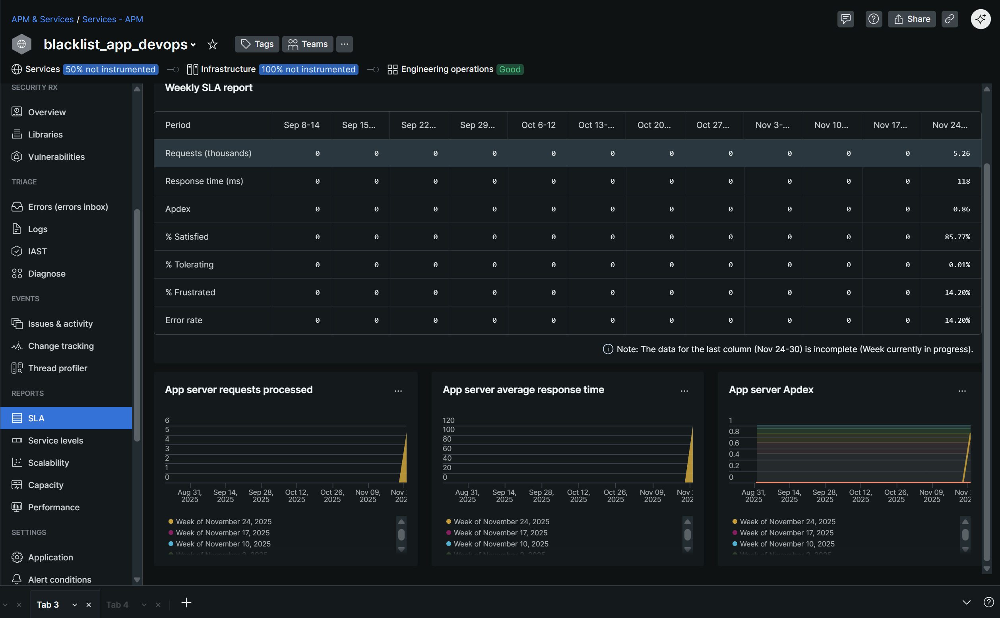

También, es posible encontrarlo en el resumen general de la aplicación:

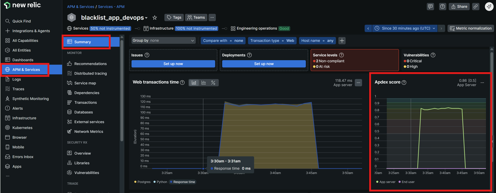

Para poder evidenciar la funcionalida de la gráfica, se hizo uso de un script para simular tráfico en la aplicación, de esta forma podemos ver que la gráfica es alimentada con los resultados y se muestra su clasificación:

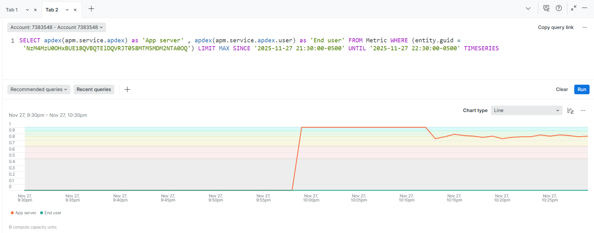

Como se puede apreciar en la anterior gráfica, inicialmente los tiempos de respuesta eran buenos, pero a medida que se va saturando la aplicación, los tiempos bajan, pero se mantienen en un rango tolerble.

A partir del Apdex, se puede generar alarmas y definir varios parámetros para que se active la alerta. Por ejemplo, se puede configurar que la alerta se active si el Apdex es menor a 0.5 por más de 1 minuto.

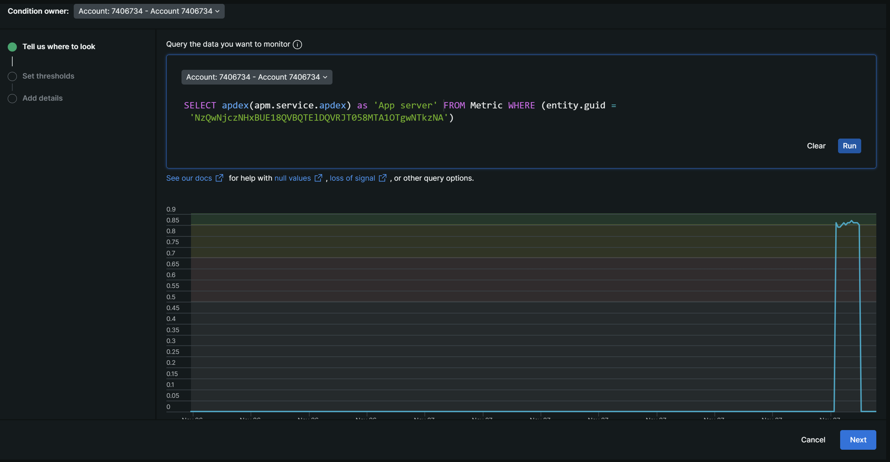

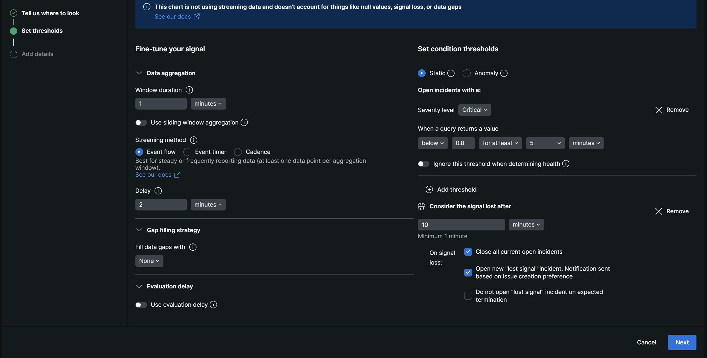

## 3. Capacidades de Monitoreo y Registro de Errores

### Capacidades de registro y monitoreo de errores 

 
A continuación se presenta un análisis de las capacidades de registro (logging) que ofrece New Relic. Para observar estas funcionalidades es necesario generar tráfico hacia la aplicación, de modo que las peticiones queden registradas tanto en los tableros de métricas como en los logs. Para esto se utiliza un script que ejecuta un número definido de solicitudes, incluyendo tanto peticiones exitosas como aquellas que provocan errores en el código. 

Dentro de la sección APM & Services de New Relic, existe una opción que permite visualizar los logs en tiempo real. En esta vista se registran todas las solicitudes realizadas a la aplicación, ofreciendo inicialmente un resumen de cada entrada de log. 

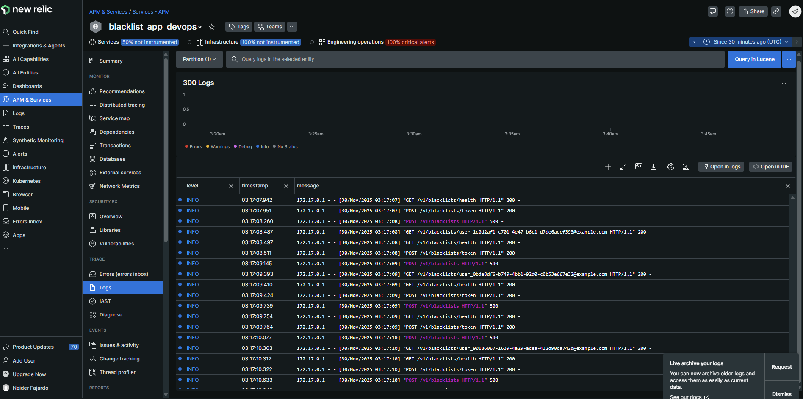

Como se aprecia en la siguiente imagen, New Relic tiene la capacidad de recopilar los logs generados por la aplicación. Estos registros pueden luego ser consultados o filtrados para obtener información relevante sobre el comportamiento de la aplicación en situaciones específicas.

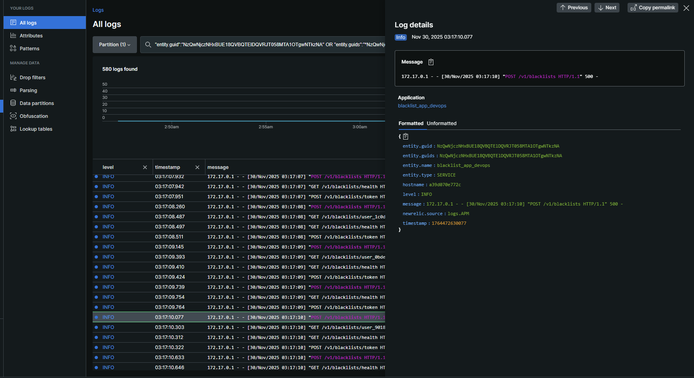

No obstante, al comparar los logs que se imprimen en la consola de la aplicación con los que se ven en New Relic, se observa que las líneas correspondientes al traceback —es decir, la información detallada del error— no aparecen en la plataforma. Esto representa una limitación importante, ya que impide realizar un seguimiento completo del error desde New Relic: se puede ver que ocurrió una falla, pero no acceder fácilmente a su causa. 

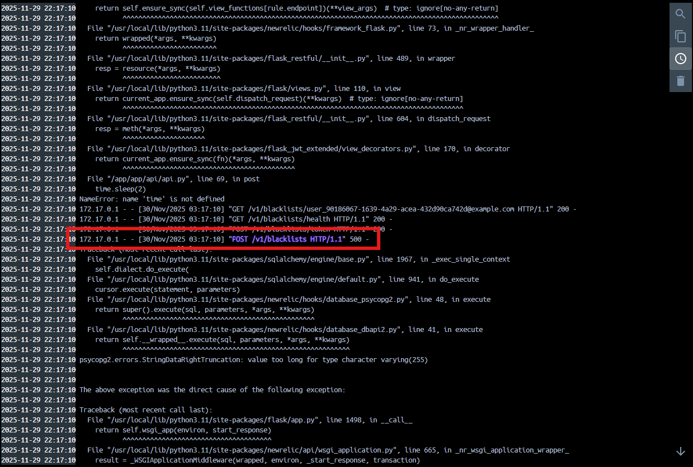

Este comportamiento se debe a que el traceback no está siendo formateado de acuerdo con lo que New Relic espera, lo que causa que la herramienta no pueda asociar ni procesar correctamente esas líneas y, por ende, deje de mostrarlas. 

Lo anterior evidencia la importancia de configurar adecuadamente la emisión de logs en la aplicación, asegurando el uso de niveles apropiados y un formato consistente. Esto no solo facilita el análisis dentro de New Relic, sino también en cualquier otra herramienta de observabilidad utilizada actualmente. 

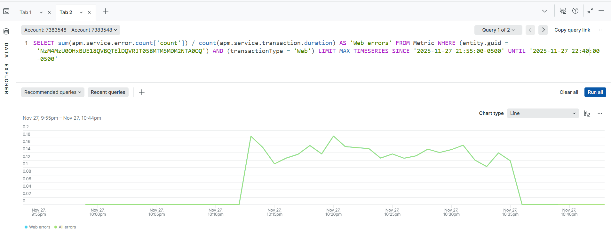

### Errores a nivel de aplicación 

A continuación, se presenta un análisis de las capacidades de monitoreo de errores que ofrece New Relic. Dentro de la sección APM & Services, la plataforma incluye un espacio dedicado específicamente a la observación y gestión de errores de la aplicación. 

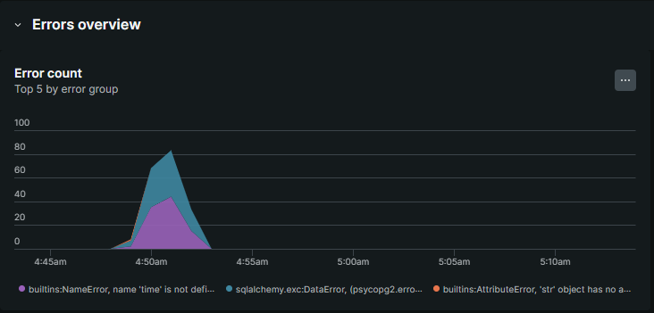

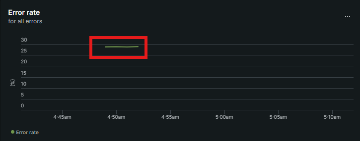

En esta vista es posible encontrar un gráfico que muestra la cantidad total de errores en una ventana de tiempo determinada, así como el porcentaje de errores ocurridos durante ese mismo periodo. Para validar esta funcionalidad, el script utilizado para generar tráfico hacia la aplicación incluye una lógica que envía peticiones que, de manera aleatoria, producen excepciones. Esto permite comparar el porcentaje de errores provocados por el script con el porcentaje que New Relic reporta en sus gráficos y confirmar que la herramienta está registrando los fallos correctamente. 

Además, New Relic ofrece una vista detallada del traceback completo de cada error, lo cual es especialmente útil para realizar un análisis más profundo y agilizar el proceso de depuración. La herramienta también clasifica los errores según su origen: ya sea por fallas en recursos externos como bases de datos o servicios terceros, o errores generados directamente en el código de la aplicación. Esta categorización resulta muy valiosa porque permite identificar rápidamente problemas de comunicación con servicios externos o fallas internas específicas. 

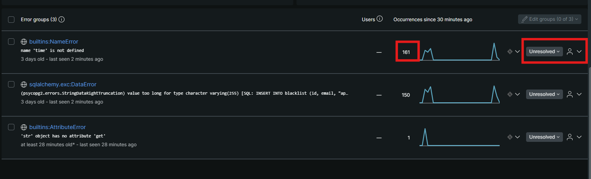

En la parte inferior de la vista se muestran los errores agrupados por tipo. Si el mismo error ocurre varias veces, New Relic lo consolida y lleva un conteo de recurrencias, además de registrar el momento en que fue detectado por primera vez. Esto facilita la identificación de errores persistentes o patrones de fallas. 

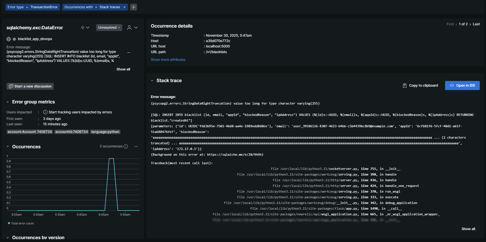

Finalmente, New Relic ofrece opciones para gestionar cada error, como asociarlo a una incidencia en Jira, marcarlo como resuelto o asignarlo a un desarrollador del equipo. Estas funcionalidades integradas ayudan a organizar el flujo de trabajo y mejorar la trazabilidad durante la corrección de errores. 

## 4. Capacidades de configuración de Alertas

En New Relic al igual que los reportes de monitoreo, las alertas se pueden configurar como comandos NRQL Query. Sin embargo la aplicación tiene una forma "guiada" de generar estas alertas.

Hay tres métricas por defecto en la opción guiada: El tiempo de respuesta, el rendimiento y el ratio de error. 

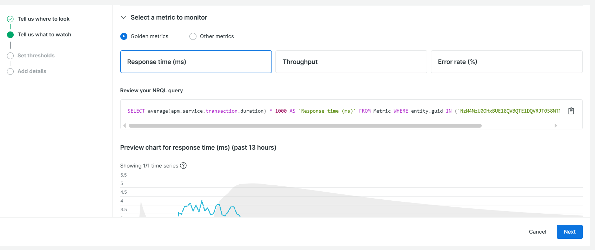

Para hacer un ejemplo vamos a tomar la unidad de medida como 1 milisegundo en tiempo de respuesta. 

Y vamos a configurar una alerta estática que se active si la unidad de medida se mantiene por encima de 2 (milisegundos) por más de 1 minuto. 

Nota: También se pueden configurar alertas dinámicas que se disparen no a través de un límite crítico sino a través de una desviación en la unidad de medida.

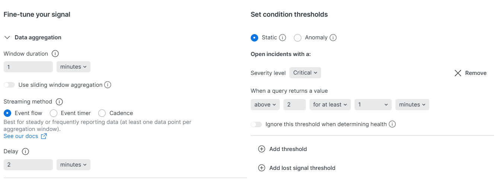

La notificación de la alerta se puede configurar al correo electrónico, a Jira, Slack, al Celular, entre otros.

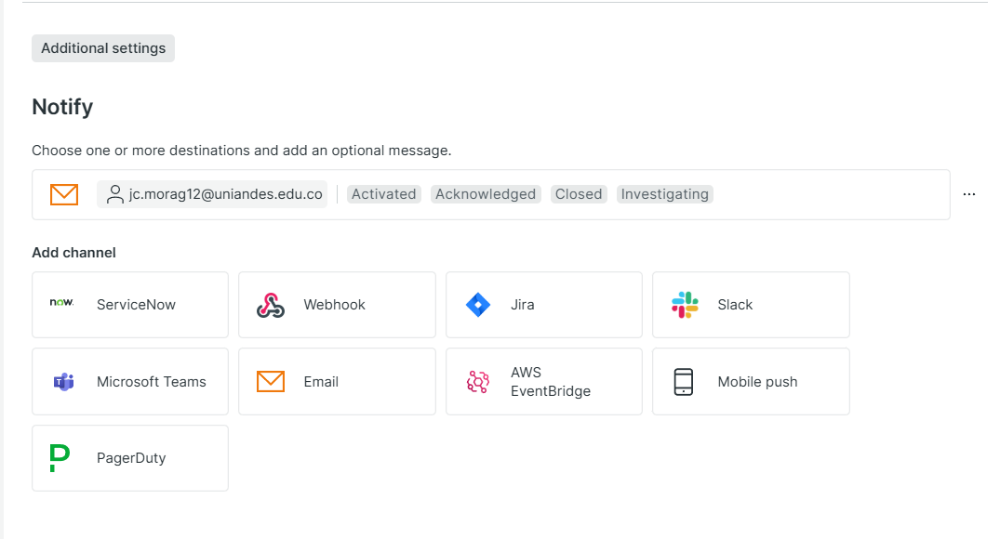

Como ya sabemos, nuestras pruebas de estrés en ejecución, tienen un tiempo de respuesta promedio de 4 segundos. Por lo que bastará para activar nuestra alerta.

Reiniciamos el ciclo de pruebas con la alerta configurada y tras un minuto podemos ver que el summary ya muestra un cambio de estado (hexagono rojo) y un label de "Alertas críticas"

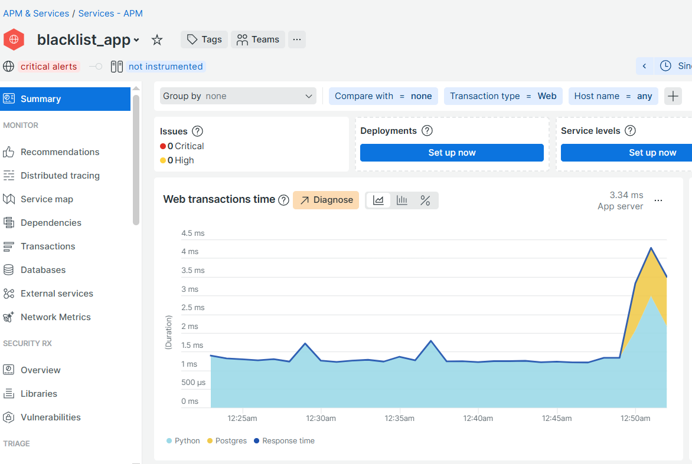

Igualmente, recibimos la notificación en el correo

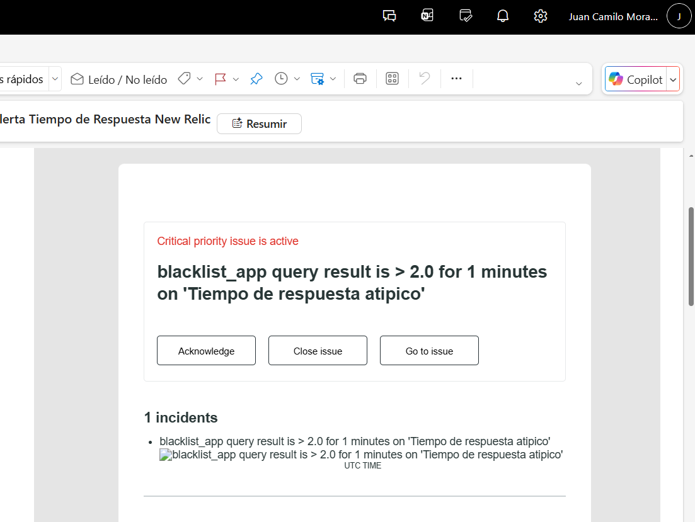

Con esto finaliza la documentación del monitoreo continuo.

## Links de referencia
- [Video](https://uniandes-my.sharepoint.com/:v:/g/personal/d_andrades_uniandes_edu_co/IQAHKH8gq0jfQo1smJmv8KLZASAL56Hb-Y28ffiXBZ6RTmc)
- [Repositorio](https://github.com/andrade1403/devops.git)
- [Colección POSTMAN](https://documenter.getpostman.com/view/49127146/2sB3QMLpC6)
